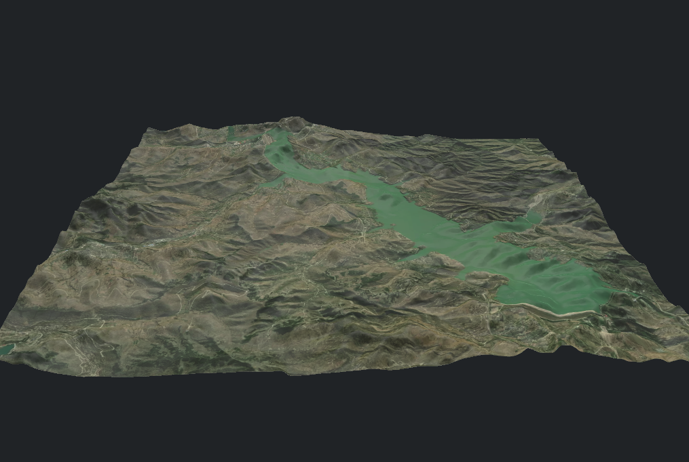

# go-static-mesh

从 DEM（数字高程模型）和卫星影像生成 3D 地形网格，支持 GLB、MST、STL、OBJ 格式输出。



## 快速开始

```bash
# 从本地 DEM 瓦片生成地形
go run ./cmd/terrain -dem data/dem -satellite data/satellite

# 多格式输出 + 闭合网格（3D 打印用）
go run ./cmd/terrain -dem data/dem -satellite data/satellite -format glb,mst,stl -close -thickness 100

# 仅 DEM 无纹理，导出 STL
go run ./cmd/terrain -dem data/dem -format stl -close
```

## CLI 参数

| 参数 | 默认值 | 说明 |
|------|--------|------|
| `-dem` | `data/dem` | DEM 瓦片目录 (`.webp` 或 `.tif`) |
| `-satellite` | `""` | 卫星影像目录 (可选) |
| `-format` | `glb` | 输出格式，逗号分隔: `glb,gltf,stl,obj,mst` |
| `-output` | `output` | 输出目录 |
| `-close` | `false` | 闭合网格（生成底面+侧壁，用于 3D 打印） |
| `-thickness` | `5` | 闭合底厚 |
| `-max-error` | `2` | TIN 简化最大误差 |
| `-exaggeration` | `1` | 垂直拉伸系数 |
| `-base-elevation` | `0` | 基础高程偏移 |
| `-zoom` | `0` | 瓦片级别 (0=自动) |

## 数据格式

### DEM 瓦片

命名格式: `{zoom}_{x}_{y}.webp` 或 `{zoom}_{x}_{y}.tif`

Mapbox terrain-RGB 编码的 WebP 文件，或 GeoTIFF 格式。

### 卫星影像瓦片

命名格式: `{prefix}_{zoom}_{x}_{y}.webp`（前缀可选），或 `.png` / `.jpg`。

## 功能

- **TIN 生成**: 从 DEM 网格生成三角化不规则网络，支持误差控制简化
- **纹理映射**: 自动拼接卫星影像瓦片，映射到地形表面
- **网格闭合**: 为 3D 打印生成水密闭包网格，含底面和侧壁
- **多材质**: 顶面使用卫星纹理，底面和侧壁使用土色材质
- **多格式输出**: GLB（二进制 glTF）、MST、STL、OBJ

## 项目结构

```
cmd/terrain/      CLI 入口
mesh/             核心网格库
  builder/         地形构建器
  writer/          格式输出 (gltf, stl, obj, mst)
tile/             瓦片数据提供
```

## 依赖

基于 [flywave](https://github.com/flywave) 生态：
- `go-geo` — 地理坐标系统
- `go3d` — 3D 数学
- `go-tin` — TIN 网格生成
- `gltf` — GLTF 输出
- `go-mst` — MST 输出
- `go-stl` — STL 输出
